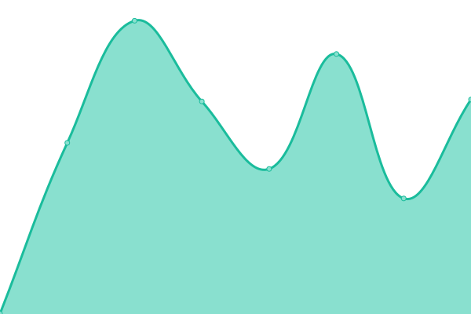

# [📈 Live Status](https://status.p3.csgroup.space): <!--live status--> **🟧 Partial outage**

This repository contains the open-source uptime monitor and status page for [CS-METIS](https://status.p3.csgroup.space), powered by [Upptime](https://github.com/upptime/upptime).

With [Upptime](https://upptime.js.org), you can get your own unlimited and free uptime monitor and status page, powered entirely by a GitHub repository. We use [Issues](https://github.com/CS-METIS/metis-dev-status-page/issues) as incident reports, [Actions](https://github.com/CS-METIS/metis-dev-status-page/actions) as uptime monitors, and [Pages](https://status.p3.csgroup.space) for the status page.

<!--start: status pages-->
<!-- This summary is generated by Upptime (https://github.com/upptime/upptime) -->
<!-- Do not edit this manually, your changes will be overwritten -->
<!-- prettier-ignore -->
| URL | Status | History | Response Time | Uptime |
| --- | ------ | ------- | ------------- | ------ |
|  [Daskhub](https://nb.p3.csgroup.space) | 🟥 Down | [daskhub.yml](https://github.com/CS-METIS/metis-dev-status-page/commits/HEAD/history/daskhub.yml) | 

 0ms
     
 | 

<a href="https://status.p3.csgroup.space/history/daskhub">0.00%</a>
    

|  [Feature server](https://feature.p3.csgroup.space/) | 🟥 Down | [feature-server.yml](https://github.com/CS-METIS/metis-dev-status-page/commits/HEAD/history/feature-server.yml) | 

 0ms
     
 | 

<a href="https://status.p3.csgroup.space/history/feature-server">0.00%</a>
    

|  [Grafana](https://grafana.p3.csgroup.space) | 🟩 Up | [grafana.yml](https://github.com/CS-METIS/metis-dev-status-page/commits/HEAD/history/grafana.yml) | 

 1337ms
     
 | 

<a href="https://status.p3.csgroup.space/history/grafana">100.00%</a>
    

|  [Kafka UI](https://kafka.p3.csgroup.space) | 🟥 Down | [kafka-ui.yml](https://github.com/CS-METIS/metis-dev-status-page/commits/HEAD/history/kafka-ui.yml) | 

 0ms
     
 | 

<a href="https://status.p3.csgroup.space/history/kafka-ui">0.00%</a>
    

|  [Keycloak](https://auth.p3.csgroup.space) | 🟩 Up | [keycloak.yml](https://github.com/CS-METIS/metis-dev-status-page/commits/HEAD/history/keycloak.yml) | 

 358ms
     
 | 

<a href="https://status.p3.csgroup.space/history/keycloak">100.00%</a>
    

|  [Launcher](https://p3.csgroup.space) | 🟩 Up | [launcher.yml](https://github.com/CS-METIS/metis-dev-status-page/commits/HEAD/history/launcher.yml) | 

 521ms
     
 | 

<a href="https://status.p3.csgroup.space/history/launcher">100.00%</a>
    

|  [Mattermost](https://chat.p3.csgroup.space) | 🟥 Down | [mattermost.yml](https://github.com/CS-METIS/metis-dev-status-page/commits/HEAD/history/mattermost.yml) | 

 0ms
     
 | 

<a href="https://status.p3.csgroup.space/history/mattermost">0.00%</a>
    

|  [Pgadmin](https://pgadmin.p3.csgroup.space) | 🟩 Up | [pgadmin.yml](https://github.com/CS-METIS/metis-dev-status-page/commits/HEAD/history/pgadmin.yml) | 

 623ms
     
 | 

<a href="https://status.p3.csgroup.space/history/pgadmin">100.00%</a>
    

|  [Spring Cloud Dataflow](https://processing.p3.csgroup.space) | 🟥 Down | [spring-cloud-dataflow.yml](https://github.com/CS-METIS/metis-dev-status-page/commits/HEAD/history/spring-cloud-dataflow.yml) | 

 0ms
     
 | 

<a href="https://status.p3.csgroup.space/history/spring-cloud-dataflow">0.00%</a>
    

|  [Superset](https://superset.p3.csgroup.space) | 🟥 Down | [superset.yml](https://github.com/CS-METIS/metis-dev-status-page/commits/HEAD/history/superset.yml) | 

 0ms
     
 | 

<a href="https://status.p3.csgroup.space/history/superset">0.00%</a>
    

|  [Topaz](https://topaz.p3.csgroup.space) | 🟥 Down | [topaz.yml](https://github.com/CS-METIS/metis-dev-status-page/commits/HEAD/history/topaz.yml) | 

 0ms
     
 | 

<a href="https://status.p3.csgroup.space/history/topaz">0.00%</a>
    

|  [Zammad](help.p3.csgroup.space) | 🟥 Down | [zammad.yml](https://github.com/CS-METIS/metis-dev-status-page/commits/HEAD/history/zammad.yml) | 

 378ms
     
 | 

<a href="https://status.p3.csgroup.space/history/zammad">0.00%</a>
    

<!--end: status pages-->

[**Visit our status website →**](https://status.p3.csgroup.space)

## 📄 License

- Powered by: [Upptime](https://github.com/upptime/upptime)
- Code: [MIT](./LICENSE) © [CS-METIS](https://status.p3.csgroup.space)
- Data in the `./history` directory: [Open Database License](https://opendatacommons.org/licenses/odbl/1-0/)
